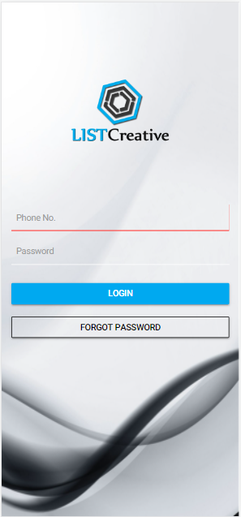
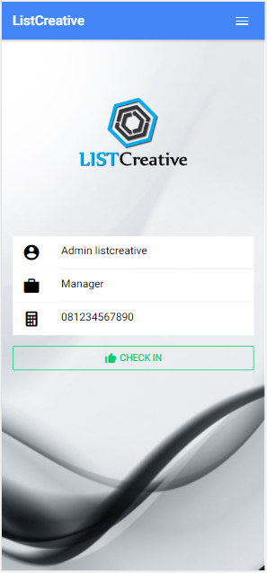
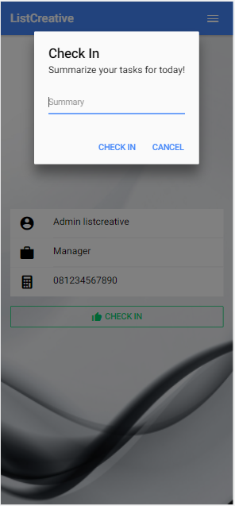
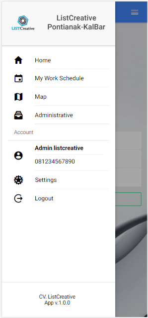
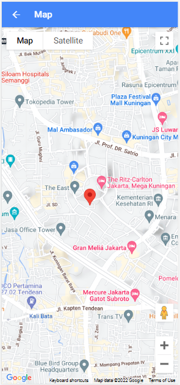
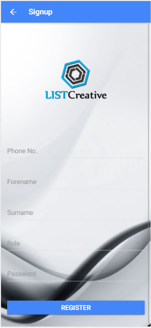
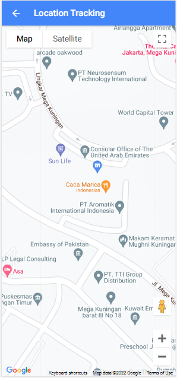
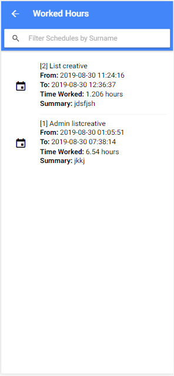

# ListCreative
Mobile management application for employee attendance

##Objectives
1. to track geographical locations of each employee on duty
2. to calculate hours put in by each employee for calculation of wages

## Screenshots

## Installations
### Prerequisites
1. PHP Server 7+
2. MySQL database server
3. NodeJS
4. Android SDKs

### Stages
1. npm i -g ionic
2. npm i -g cordova
3. Open project folder via console and run
npm i
4. extract the api.zip and add to web root
5. create database named apiemployee and import listcreative.sql
6. in project path run
ionic serve
7. when the login screen appears, slide from left to right and configure server ip e.g http://localhost/api/
